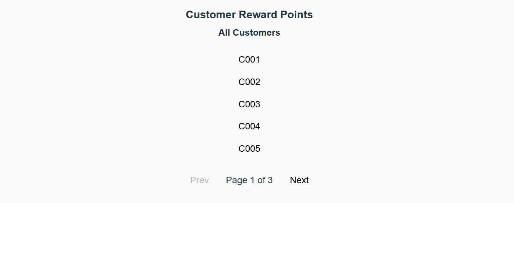
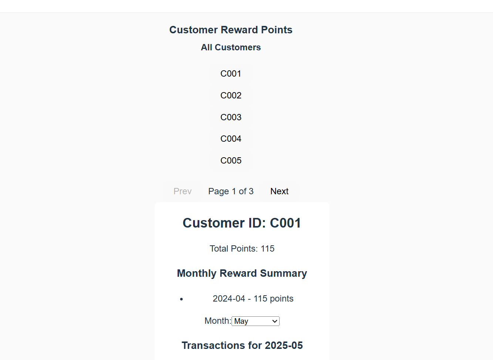

# React + Vite

open the project then type the command - npm run dev

This template provides a minimal setup to get React working in Vite with HMR and some ESLint rules.

- [@vitejs/plugin-react](https://github.com/vitejs/vite-plugin-react/blob/main/packages/plugin-react) uses [Babel](https://babeljs.io/) for Fast Refresh

Points - 
1. Follow the react component structure and naming convention .
2. Created the local JSON mock file.
3. Achieved the functionalities are - 
   a. Display all customers and selected customer points
4. Added the Month, Year dropdown filter
5. Added the pagination to manage the customer list.
6. Checked the unit test and write the proper code.
7. Used styled components for CSS styling

Attched the screenshots

